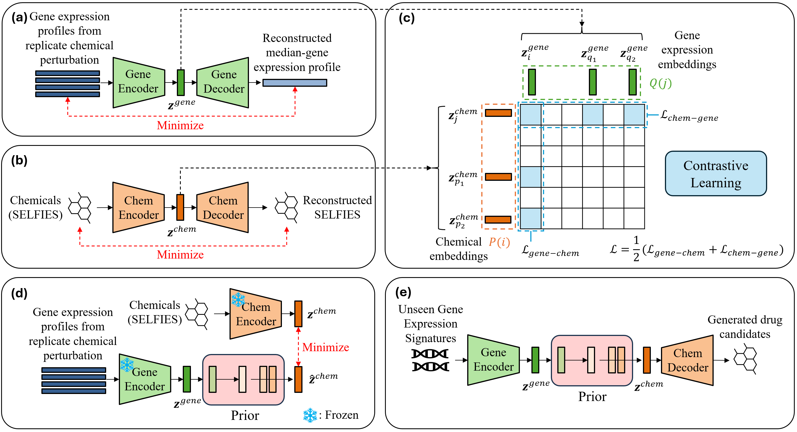

# Latent Diffusion Prior for MolGene-E

This is the official code release for

[**Latent Diffusion Prior for MolGene-E**](https://openreview.net/forum?id=WBaXgzYvaj).

by Rahul Ohlan, Raswanth Murugan, Li Xie, Mohammadsadeq Mottaqi, Shuo Zhang, Lei Xie



### Abstract
Designing drugs that can restore a diseased cell to its healthy state is an emerging approach in systems pharmacology to address medical needs that conventional target-based drug discovery paradigms have failed to meet. Single-cell transcriptomics can comprehensively map the differences between diseased and healthy cellular states, making it a valuable technique for systems pharmacology. However, single-cell omics data is noisy, heterogeneous, scarce, and high-dimensional. As a result, no machine learning methods currently exist to use single-cell omics data to design new drug molecules. We have developed a new deep generative framework named MolGene-E to tackle this challenge. MolGene-E combines two novel models: 1) a cross-modal model that can harmonize and denoise chemical-perturbed bulk and single-cell transcriptomics data, and 2) a contrastive learning-
based generative model that can generate new molecules based on the transcriptomics data. MolGene-E consistently outperforms baseline methods in generating high-quality, hit-like molecules from gene expression profiles obtained from single-cell datasets as validated by target knock-out experiments using CRISPR. This superior performance is demonstrated across diverse de novo molecule generation metrics. This makes MolGene-E a potentially powerful new tool for drug discovery.

### Citation
```
@inproceedings{
ohlan2024molgenee,
title={MolGene-E: Inverse Molecular Design to Modulate Single Cell Transcriptomics},
author={Rahul Ohlan and \textbf{Raswanth Murugan} and Li Xie and Mohammadsadeq Mottaqi and Shuo Zhang and Lei Xie},
booktitle={ICML 2024 AI for Science Workshop},
year={2024},
url={https://openreview.net/forum?id=WBaXgzYvaj}
}
```
## Environment
A suitable environment can be created with the following commands. 
```bash
conda env create -f environment.yml
```
## Training

After this is trained, you can then train a latent diffusion model with
```bash
./scripts/diffusion/bart_latent_v-pred.sh
```

## Acknowledgement
This work is built upon open-source implementations from [Lucidrains](https://github.com/lucidrains). Specifically, we adapted his Pytorch DDPM implementation ([link](https://github.com/lucidrains/denoising-diffusion-pytorch)), built upon his transformer implementation ([link](https://github.com/lucidrains/x-transformers)), and adapted his perceiver implementation for our language autoencoder ([link](https://github.com/lucidrains/flamingo-pytorch)). The SELFIES language autoencoder was adopted from ([link](https://huggingface.co/zjunlp/MolGen-large)).
