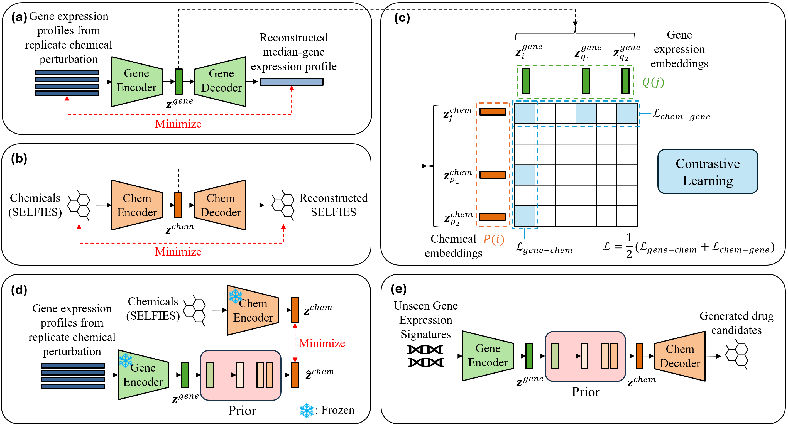

# Latent Diffusion Prior for MolGene-E

> **Work in progress.** A version of this work is under scientific review.

Related publication:

[**MolGene-E: Inverse Molecular Design to Modulate Single Cell Transcriptomics**](https://www.biorxiv.org/content/10.1101/2025.02.19.638723v2)
— *accepted at the ICML AI for Science Workshop 2024*

by Rahul Ohlan, **Raswanth Murugan**, Li Xie, Mohammadsadeq Mottaqi, Shuo Zhang, Lei Xie



---

## Overview

MolGene-E generates drug-like molecules **conditioned on gene-expression profiles**, so a
diseased cell's transcriptomic signature can be mapped to candidate molecules that might
shift it back toward a healthy state. This repository implements the **generative prior**:
a **latent diffusion model over molecules** (represented as
[SELFIES](https://github.com/aspuru-guzik-group/selfies)), conditioned on a
gene-expression / property vector, with an optional **Diffusion-DPO** preference-tuning stage.

Rather than diffusing over raw token sequences, molecules are first **compressed** into a
small continuous latent space by an autoencoder built on the frozen
[MolGen](https://huggingface.co/zjunlp/MolGen-large) (BART) language model. Gaussian
diffusion then runs **in that latent space**, and the denoised latent is **decompressed**
back into a SELFIES string.

### The two training stages

The whole project is two training scripts (this is the flow worth remembering):

| Stage | Script | What it learns |
|-------|--------|----------------|
| **1. Compression autoencoder** | [`train_latent_model.py`](train_latent_model.py) | SELFIES → compress to latent `z` → decompress → reconstruct the SELFIES. Learns the latent space; MolGen stays frozen, only the autoencoder is trained. |
| **2. Conditional latent diffusion** | [`train_text_diffusion.py`](train_text_diffusion.py) | Trains a diffusion model in the Stage-1 latent space. Given a **gene-expression (or property) vector** as conditioning, it denoises a latent which is then decompressed into the corresponding molecule. Also hosts the optional DPO fine-tuning. |

```
  Stage 1 — Compression autoencoder  (train_latent_model.py)
  ┌──────────────────────────────────────────────────────────────────────┐
  │ SELFIES → MolGen encoder → COMPRESS → latent z → DECOMPRESS → SELFIES  │
  │                              (train these two, MolGen frozen)          │
  └──────────────────────────────────────────────────────────────────────┘
                                     │  the trained latent space
                                     ▼
  Stage 2 — Conditional latent diffusion  (train_text_diffusion.py)
  ┌──────────────────────────────────────────────────────────────────────┐
  │  gene-expression / property vector ─┐                                  │
  │                                     ├─► diffusion denoiser → latent z  │
  │             noised latent z_t ──────┘                          │       │
  │                                       Stage-1 decompressor ◄───┘       │
  │                                              ▼                         │
  │                                      generated SELFIES → metrics       │
  └──────────────────────────────────────────────────────────────────────┘
            (+ optional Stage 3: Diffusion-DPO preference fine-tuning)
```

The conditioning vector can be:
- **gene expression** (`--task phenotype`) — the core MolGene-E setting,
- **gene CLIP embeddings** (`--task phenotype_clip`),
- a **multi-objective property vector** — QED / SA / GSK3β / JNK3 (`--task multi-objective`).

The `multi-objective` task ships with bundled data and is the easiest way to run the full
pipeline end to end.

---

## Repository structure

| Path | What it contains |
|------|------------------|
| `train_latent_model.py` | **Stage 1 entry point** — train/eval the compression autoencoder. |
| `train_text_diffusion.py` | **Stage 2 entry point** — train/eval the conditional latent diffusion model & DPO. |
| `latent_models/` | The autoencoder implementations (Perceiver AE + MolGen/BART & T5 wrappers) and the Stage-1 trainer (`latent_finetuning.py`). |
| `model/` | The diffusion transformer denoiser and its attention backbone. |
| `diffusion/` | Gaussian diffusion, samplers (DDPM / DDIM / DPM++), noise schedules, the DPO loss, and the Stage-2 trainer (`text_denoising_diffusion.py`). |
| `dataset_utils/` | Molecular & text datasets, collators, and property scorers (`score_modules/`). |
| `evaluation/` | Chemistry metrics (validity, uniqueness, novelty, diversity, Tanimoto) + text metrics. |
| `datasets/Multi-Obj-Dataset/` | Bundled SELFIES data for the multi-objective task (incl. DPO pairs). |
| `data_analysis/` | Exploratory dataset analysis / distribution plots. |
| `scripts/` | Example launch commands for the autoencoder, diffusion, and evaluation. |
| `figures/` | Architecture / method figures. |
| `oracle/`, `dataset_utils/score_modules/` | Pretrained property-scoring models (GSK3β, JNK3, SA, ESOL). |

---

## Setup

```bash
# Option A: pip
pip install -r requirements.txt

# Option B: full pinned conda environment
conda env create -f environment.yml
conda activate latent-lang-diff
```

Notes:
- Training requires a CUDA GPU (the trainers call `.cuda()` and use 🤗 `accelerate`).
- Property scoring uses [PyTDC](https://tdcommons.ai/) oracles (QED / SA / GSK3β / JNK3),
  downloaded on first use.
- The MolGen weights (`zjunlp/MolGen-large`) are pulled from the Hugging Face Hub.
- Logging uses Weights & Biases. Pass `--wandb_entity <you>` or set `WANDB_ENTITY`;
  run `wandb disabled` to turn it off.

---

## Usage

### Stage 1 — Train the compression autoencoder

Learns the latent space the diffusion model will operate in: SELFIES in → compress →
decompress → reconstruct, with MolGen frozen and only the autoencoder trained.

```bash
python train_latent_model.py \
  --dataset_name HUBioDataLab/SELFormer-selfies \
  --enc_dec_model zjunlp/MolGen-large \
  --num_encoder_latents 16 --num_decoder_latents 16 --dim_ae 8 --num_layers 3 \
  --l2_normalize_latents \
  --learning_rate 1e-4 --lr_warmup_steps 1000 --train_batch_size 1 \
  --eval_every 1000 --wandb_name molgen-ae
```

Checkpoints land in `saved_latent_models/<dataset>/<timestamp>/` (an `args.json` plus the
model weights). You pass that directory to Stage 2 as `--latent_model_path`. See
[scripts/autoencoder/bart_base_roc.sh](scripts/autoencoder/bart_base_roc.sh).

> The gene-expression autoencoder that produces the conditioning embeddings for the
> `phenotype` task lives in the companion
> [MolGen-E](https://github.com/RaswanthMurugan20/MolGen-E) repository (`Gene-AE/`),
> together with the cross-modal CLIP alignment.

### Stage 2 — Train the conditional latent diffusion model

Multi-objective conditioning (runs on the bundled data):

```bash
python train_text_diffusion.py \
  --task multi-objective --vector_conditional --condition_dim 4 \
  --enc_dec_model zjunlp/MolGen-large \
  --latent_model_path saved_latent_models/<your-stage1-run> \
  --tx_dim 512 --tx_depth 12 --num_dense_connections 3 \
  --objective pred_x0 --loss_type l2 --train_schedule cosine \
  --self_condition --scale_shift --train_prob_self_cond 0.5 \
  --sampling_timesteps 80 --learning_rate 2e-4 --train_batch_size 32 \
  --num_train_steps 65000 --save_and_sample_every 750 --num_samples 100 \
  --wandb_name multiobj
```

Gene-expression conditioning (`--task phenotype`) is the core MolGene-E setting. Those
single-cell datasets are **not bundled** — supply them via `--gene_train_path`,
`--gene_val_path`, `--gene_test_path` (and `--gene_clip_path` for `phenotype_clip`), and set
`--condition_dim` to your gene-vector size. See
[scripts/diffusion/bart_latent_v-pred.sh](scripts/diffusion/bart_latent_v-pred.sh).

### Stage 3 (optional) — Diffusion-DPO fine-tuning

```bash
python train_text_diffusion.py \
  --task dpo_training --vector_conditional --condition_dim 4 \
  --latent_model_path saved_latent_models/<your-stage1-run> \
  --beta 5000 --num_train_steps 1000 --wandb_name dpo \
  # ... (same model / diffusion flags as Stage 2)
```

DPO trains on the bundled winner/loser pairs in
`datasets/Multi-Obj-Dataset/dpo_{train,test}_data.txt`.

### Sample & evaluate

```bash
python train_text_diffusion.py --eval \
  --resume_dir saved_diff_models/<your-stage2-run> \
  --sampler ddpm --sampling_schedule cosine \
  --sampling_timesteps 250 --num_samples 1000 --wandb_name eval
```

See [scripts/diffusion/eval.sh](scripts/diffusion/eval.sh). Generated molecules are scored
with the metrics in [evaluation/chem_evaluation.py](evaluation/chem_evaluation.py)
(validity, uniqueness, novelty, internal diversity, Tanimoto similarity).

---

## Data

- **Bundled:** `datasets/Multi-Obj-Dataset/` — SELFIES strings for the multi-objective task
  (`*_positive_data.txt`) and DPO preference pairs (`dpo_*_data.txt`).
- **External (not included):** the single-cell / bulk gene-expression datasets used for the
  `phenotype` tasks. Point the `--gene_*` arguments at your own copies.

---

## Citation

```bibtex
@inproceedings{ohlan2024molgenee,
  title     = {MolGene-E: Inverse Molecular Design to Modulate Single Cell Transcriptomics},
  author    = {Rahul Ohlan and Raswanth Murugan and Li Xie and Mohammadsadeq Mottaqi and Shuo Zhang and Lei Xie},
  booktitle = {ICML 2024 AI for Science Workshop},
  year      = {2024},
  url       = {https://www.biorxiv.org/content/10.1101/2025.02.19.638723v2}
}
```

---

## Acknowledgement

Built on open-source implementations from [lucidrains](https://github.com/lucidrains) —
the PyTorch [DDPM](https://github.com/lucidrains/denoising-diffusion-pytorch),
[x-transformers](https://github.com/lucidrains/x-transformers), and the
[perceiver/resampler](https://github.com/lucidrains/flamingo-pytorch) — and the
[MolGen-large](https://huggingface.co/zjunlp/MolGen-large) SELFIES language model.
